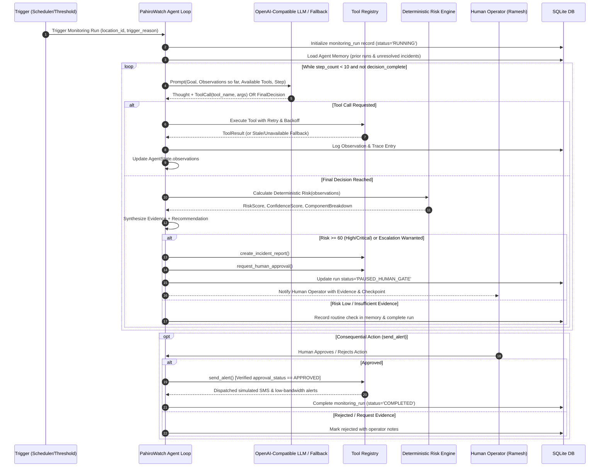

# PahiroWatch — Bounded Agent Loop Specification

This document details the multi-step bounded agent loop, tool calling mechanics, failover policies, and human approval verification.

---

## 1. Bounded Agent Execution Loop (Max 10 Steps)

---

## 2. Mandatory Tool Specifications

| Tool Name | Purpose | Return Value Structure |
|---|---|---|
| `get_weather_rainfall` | DHM / Open-Meteo rainfall telemetry | `rainfall_1h`, `rainfall_6h`, `rainfall_24h`, `rainfall_72h`, `source`, `freshness_minutes`, `data_quality` |
| `get_terrain_risk` | Digital Elevation Model (DEM) slope & aspect | `elevation_m`, `slope_deg`, `aspect_cardinal`, `terrain_risk_score`, `source`, `resolution` |
| `get_satellite_change` | Sentinel-2 spectral difference / OBIA change indicator | `change_score`, `vegetation_loss_index`, `surface_change_indicator`, `cloud_cover_pct`, `imagery_dates`, `source`, `confidence` |
| `get_road_exposure` | OSM proximity to lifeline highway & settlements | `nearest_road`, `road_class`, `distance_to_road_m`, `settlements_nearby`, `critical_infrastructure`, `exposure_score` |
| `get_incident_memory` | SQLite cross-run history & unresolved events | `previous_incidents_count`, `last_incident_date`, `unresolved_incidents`, `historical_risk_multiplier` |
| `create_incident_report` | Persists structured incident record | `incident_id`, `status`, `summary_en`, `summary_ne` |
| `request_human_approval` | Hard human gate checkpoint | `approval_id`, `prompt`, `options`, `expires_in` |
| `send_alert` | Outbound notification (simulated SMS, Nepali text, low-BW) | `alert_id`, `delivery_status`, `channels_dispatched` |

---

## 3. Resilience & Degradation Rules (The "Bad Day" Policy)

1. **Weather Failure:**
   - Attempt 2 retries with exponential backoff (0.5s, 1.0s).
   - If still failing, fall back to last cached observation. Flag as `STALE (X hrs)`.
   - Reduce overall confidence score by 0.15.
2. **Satellite Failure (or Cloud Cover > 70%):**
   - Attempt retry.
   - If unavailable, mark `SATELLITE_UNAVAILABLE` or `LOW_IMAGE_QUALITY (Cloud-contaminated)`.
   - Reduce overall confidence score by 0.20.
   - Agent explicitly states: *"Satellite confirmation is unavailable. Rainfall, terrain, and exposure evidence remain sufficient to recommend human inspection, but confidence is reduced."*
3. **LLM Endpoint Failure / Timeout:**
   - Catch timeout / connection error.
   - Immediately switch to **Deterministic Safety Fallback Engine**.
   - UI prominently displays: `"RESILIENCE MODE — Deterministic Safety Fallback Active"`.
   - Still execute full deterministic risk score, create incident if risk > 60, and prompt human operator.
4. **Human Checkpoint Protection:**
   - `send_alert` directly queries the `approvals` database table for `action_type = 'APPROVE'`.
   - If not approved, execution throws `SecurityViolationError` and fails closed.
