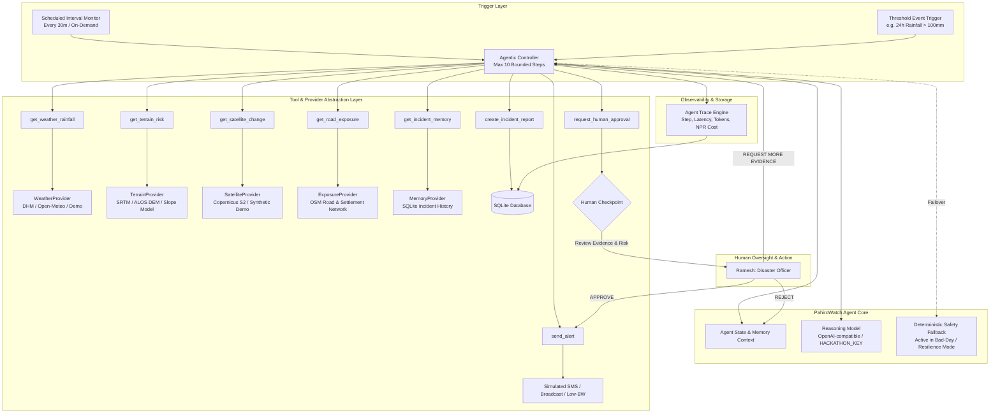

# PahiroWatch — Architecture Specification

> **"Detect the slope. Protect the road. Alert before the disaster."**  
> Autonomous Landslide-Risk Monitoring & Operational Response Agent for Nepal

---

## 1. Executive Summary & Operational Context

**PahiroWatch** is an autonomous geospatial response agent built specifically for high-risk mountain highway corridors in Nepal. Rather than acting as an unverifiable "black-box" prediction tool, PahiroWatch is a **decision-support and early-warning operations system**. It continuously monitors assigned road corridors, investigates multi-source environmental signals upon trigger, calculates deterministic risk and confidence indices, and enforces a mandatory **Human-in-the-Loop checkpoint** before any official emergency action is dispatched.

### Pilot Deployment
- **Target Corridor:** Narayanghat–Mugling Highway (National Highway 05) & Prithvi Highway Junction.
- **Administrative Jurisdiction:** Ichhyakamana Rural Municipality (Wards 4, 5, and 6: Kurintar, Jalbire, Charkilo, Dahakhani).
- **Target Operator:** Ramesh, Municipal Disaster Management Officer & Road Operations Coordinator.

---

## 2. High-Level Architecture

---

## 3. Core Architectural Principles

1. **Strict Separation Between Observation and Inference:**  
   The LLM agent is strictly prohibited from inventing numerical readings. Rainfall, slope degrees, change indices, and distance measurements are supplied exclusively by deterministic tools.
2. **Deterministic Evidence Aggregation (Risk Engine):**  
   The quantitative risk score (0–100) is calculated via a transparent, weighted formula with explicit prototype calibration disclaimers. The LLM performs synthesis, context reasoning, and action recommendations.
3. **Resilience & Graceful Degradation (Bad Day Architecture):**  
   If an external API (such as weather or satellite) times out or returns corrupted data, the system implements exponential backoff, records data freshness, degrades confidence honestly, and continues with remaining evidence. If the LLM itself is unreachable, a hardcoded rule-based fallback safeguards operational continuity.
4. **Mandatory Human-in-the-Loop Checkpoint:**  
   `send_alert()` enforces an unbypassable backend constraint: execution is rejected with an HTTP 403 / AgentSecurityError unless `approval_status == 'APPROVED'`.
5. **Radical Data Honesty:**  
   Every data point in the UI and trace is tagged with its provenance: `REAL`, `SYNTHETIC DEMO DATA`, `STALE (X hrs)`, or `DATA UNAVAILABLE`.

---

## 4. Technology Stack

- **Backend Framework:** FastAPI (Python 3.10+)
- **Database:** SQLite 3 with Foreign Keys enabled & WAL mode
- **Geospatial Engine:** Shapely, PyProj, GeoJSON
- **LLM Integration:** OpenAI-compatible API client via standard `httpx` with `HACKATHON_KEY` / `OPENAI_API_KEY`
- **Frontend Framework:** React 18, Vite, TypeScript
- **Styling:** Vanilla CSS & Tailwind CSS for emergency operations center design system
- **Geospatial Visualization:** Leaflet / React-Leaflet with custom tile styling and topographic overlays
- **Analytical Charts:** Recharts for rainfall trends and risk component breakdowns
